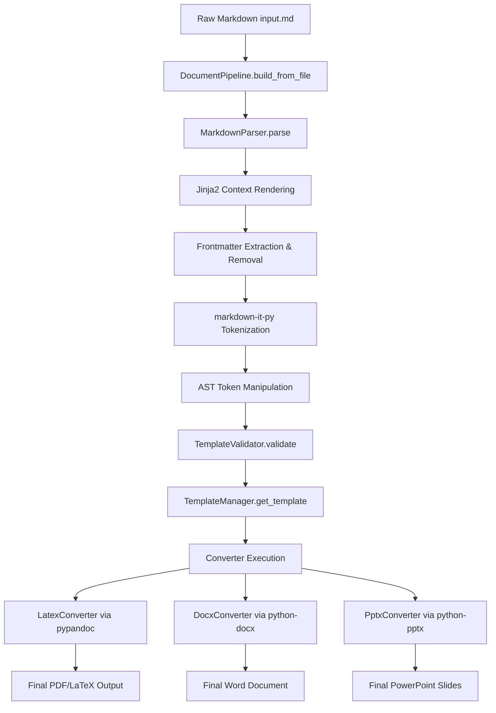

# OpenDocAgent Architecture & Markdown Codepath

This guide provides a comprehensive walkthrough of how Markdown is generated and structured for OpenDocAgent, followed by the exact codepath that the custom Markdown follows through our pipeline from raw file to finalized formatted document.

---

## 1. Markdown Structure & Generation

Markdown files generated or consumed by OpenDocAgent are structured into three distinct regions:

### A. YAML Frontmatter (Metadata Block)
Every OpenDocAgent document starts with a YAML metadata block enclosed by triple hyphens (`---`). This acts as the visual and structural configuration layer:

```yaml
---
title: "Quarterly Performance Report"
author: "Lead Agent"
format: "beamer"         # Options: pdf, docx, pptx, beamer, latex
style: "executive"       # Options: executive, technical (influences template lookups)
toc: true                # Injects an automated Table of Contents
numbersections: true     # Number headers automatically
pandoc_vars:             # Custom variables passed directly to Pandoc
  fontsize: "12pt"
---
```

### B. Dynamic Templating (Jinja2)
The markdown contains Jinja2 expressions for dynamic data injection (e.g., table populations, date formats, or names):

```markdown
# Quarterly Review for {{ department }}
Data was last aggregated on **{{ run_date }}**.
```

### C. Custom Layout & Element Directives
We support rich elements using custom AST (Abstract Syntax Tree) targets:
*   **Mermaid Diagrams**: Fenced codeblocks (` ```mermaid `) are natively supported for generating flowcharts.
*   **Multi-Column Presentation Layouts**: Separators such as `::: col` allow splitting content into multi-column visual segments on slides or reports.

---

## 2. OpenDocAgent Codepath

When you run OpenDocAgent (either via CLI `opendocagent build input.md` or the Python API), the file traverses a series of modular layers:



### Step 1: Entry & Initialization (`cli.py` ➔ `pipeline.py`)
1. The execution starts inside the `DocumentPipeline` (found in `opendocagent/pipeline.py`).
2. The pipeline loads the raw file text and triggers `DocumentPipeline.build(content, input_file, output_format, context)`.

### Step 2: Markdown Parsing & AST Manipulation (`parser.py`)
The pipeline hands the raw markdown to the `MarkdownParser` (found in `opendocagent/parser.py`) where four things occur:

1.  **Jinja2 Expansion**: If a context dictionary is passed via `--data`, Jinja2 compiles the markdown template and renders the dynamic variables first.
2.  **Frontmatter Parsing**: A regex identifies the YAML block. The frontmatter is parsed via `pyyaml` into a `metadata` dictionary and stripped from the document body.
3.  **AST Tokenization**: The rest of the markdown is parsed into standard token objects using the `markdown-it-py` parser.
4.  **AST Token Manipulation**:
    *   **Auto-TOC**: If `toc: true` is set in the frontmatter, table-of-contents tokens (`[[TOC]]`) and horizontal rules are prepended to the token stream.
    *   **Mermaid Swapping**: Fence blocks defined with `mermaid` are swapped out on the fly with image placeholder tokens (``) to prepare for asset compilation.
    *   **Multi-Column Handling**: `::: col` directives inside inline tokens are cleaned and converted to standard comment delimiters.

### Step 3: Linting & Validation (`validator.py`)
The metadata and modified AST token stream are passed to the `TemplateValidator`.
*   It lint-checks design-guide compliance. For example, if you chose the `executive` archetype style but generated a presentation deck with more than 30 slides, it throws structural recommendations or warnings.

### Step 4: Template Matching (`template_manager.py`)
*   The `TemplateManager` resolves style-guide paths depending on the archetype (`executive` vs. `technical`) and target extension.
*   It grabs either package-internal custom LaTeX headers (`opendocagent/templates/latex/`), Word templates (`.dotx`), or PowerPoint structures (`.potx`) to apply modern visual layouts.

### Step 5: Converter Routing & File Conversion (`converters/`)
The pipeline looks up the registered converter for the target format:
*   **LaTeX / PDF (`latex.py`)**: 
    1.  The `LatexConverter` configures the Pandoc execution parameters. 
    2.  If the format is `beamer`, it sets up Beamer slide levels, aspects, and appends the custom HSL `beamer_style.tex` header template.
    3.  If it is an article/report, it maps geometry, fonts, margins, and the `document_style.tex` header template.
    4.  It calls `pypandoc.convert_text` under the hood to compile the markdown to its destination `.pdf` or `.tex` file using the system's Pandoc installation.
*   **Word (`docx_conv.py`)** & **PowerPoint (`pptx_conv.py`)**:
    *   Utilize `python-docx` and `python-pptx` to construct structures using our built-in brand-themed template layouts.
