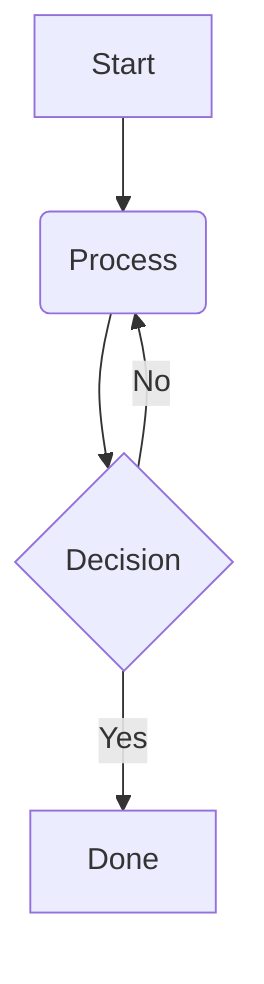

# OpenDocAgent Markdown Syntax Guide

This guide explains how to write Markdown documents that are fully compatible with OpenDocAgent's custom parser and layout engine.

---

## 1. Document Configuration (YAML Frontmatter)

Every markdown document must start with a YAML block at the absolute top of the file:

```yaml
---
title: "Document Title"
subtitle: "Optional Subtitle"
author: "Author Name"
institute: "Optional Company/Institute"
date: "2026-05-20"
format: "pdf"            # pdf, docx, pptx, beamer, or latex
style: "executive"       # executive or technical
toc: true                # Injects an automated Table of Contents (PDF/DOCX only)
numbersections: true     # Automatically number headers
---
```

---

## 2. Formatting Slides (PPTX & Beamer)

When target format is `pptx` or `beamer`, standard markdown elements are mapped to slides as follows:

*   **Title Slide**: Use a Level-1 header (`#`) to create a Title Slide; any paragraph immediately following becomes the subtitle.
*   **Slide Separator**: Use `---` on a blank line to start a new slide.
*   **Slide Title**: Use a Level-2 header (`##`) for each content slide title.
*   **Content**: Nested bullet lists, paragraphs, columns, and diagrams.
*   **Speaker Notes**: Use blockquotes (`> Note: ...`) or paragraphs (`Note: ...`) to populate the slide's speaker notes.

### Example Presentation:
```markdown
---
title: "Sales Pitch"
format: "pptx"
style: "executive"
---

# Q3 Business Review
Accelerating Customer Growth in Enterprise

---

## Market Landscape
- Strong expansion in AI developer tooling
  - High demand for agentic workflows
  - Integration with FastMCP protocols
- Competitor shifts toward proprietary models

> Note: Emphasize that our open agentic pipeline gives enterprise clients complete data sovereignty.

---

## Strategic Initiatives

Left Column Focus:
- Core Platform
- Agent API

::: col

Right Column Focus:
- FastMCP Integration
- Enterprise Compliance
```

---

## 3. Custom Markdown Directives

OpenDocAgent extends standard Markdown syntax with custom directives:

### A. Multi-Column Layouts (`::: col`)
Use `::: col` on a separate line to signal a column boundary, allowing adjacent elements to be positioned side-by-side:

```markdown
## Two-Column Slide

Left column content:
- Point 1
- Point 2

::: col

Right column content:
- Detail A
- Detail B
```

### B. Mermaid.js Diagrams
Embed diagrams using the `mermaid` fence indicator:



### C. Dynamic Jinja2 Templating
Inject variables into your Markdown dynamically. Variables are populated using `--data data.json` on the command line:

```markdown
# Q3 Sales for {{ department }}
Total Q3 Sales closed at **{{ sales_count }}** contracts.
```

---

## 4. Writing Archetypes

OpenDocAgent enforces strict lints and guidelines based on the `style` flag:

### Executive Style
*   **Bottom-Line First**: Lead with the conclusions on the first page or slide.
*   **Highly Scannable**: Concise bullet lists.
*   **No Clutter**: Offload all detailed code blocks, raw data tables, and heavy methodologies to a `# Appendix` section at the end of the document.

### Technical Style
*   **Strict Hierarchy**: Use deep, structured, logical headers (`#`, `##`, `###`).
*   **Comprehensive Data**: Incorporate inline tables, codeblocks, and diagrams.
*   **High Rigour**: Detail-rich methodology, purposes, and scope sections.
